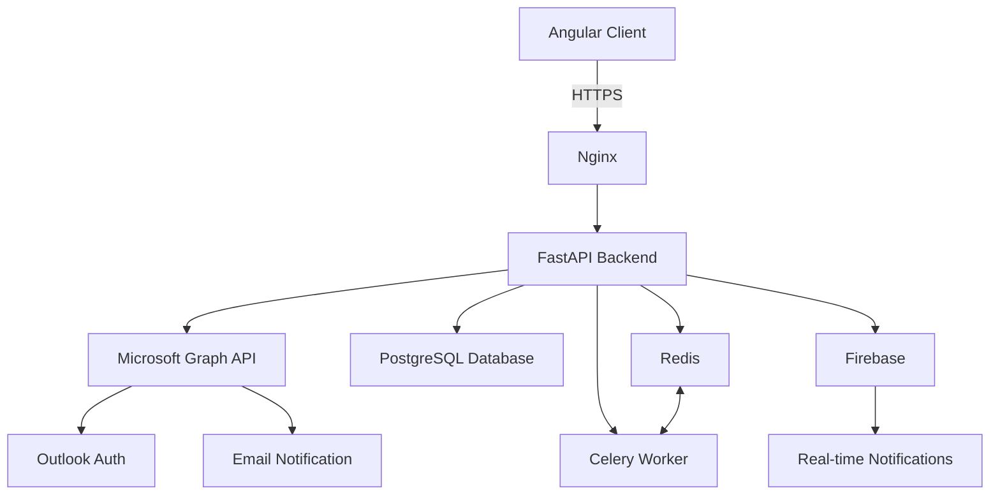

The HealthStaff system architecture is designed to be robust, scalable, and secure. It employs a modern Models-based approach, ensuring flexibility and ease of maintenance.

## 1. Overview

## 2. Key Components

### 2.1 Frontend

- **Angular Client:** Provides a responsive and intuitive user interface.
- **Responsive Design:** Ensures consistent user experience across devices.

### 2.2 Backend

- **Nginx:** Web server acting as a reverse proxy and handling SSL termination.
- **FastAPI:** Python-based backend framework for building efficient API endpoints.
- **Celery:** Task queue for handling background and scheduled jobs.
- **Redis:** Used as a message broker for Celery and for caching.

### 2.3 Database

- **PostgreSQL:** Main database for storing all application data.

### 2.4 Authentication and Notifications

- **Microsoft Graph API:**
- Handles user authentication using Outlook credentials.
- Manages email notifications.
- **Firebase:** Provides real-time notifications to the client.

## 3. Data Flow

1. Client requests are sent via HTTPS to Nginx.
2. Nginx handles SSL termination and routes the request to the FastAPI backend.
3. FastAPI processes the request, interacting with:
- **PostgreSQL** for data storage and retrieval.
- **Microsoft Graph API** for authentication and email notifications.
- **Celery** for scheduling background tasks.
- **Firebase** for sending real-time notifications.
4. The response is sent back through Nginx to the client.

## 4. Security

- **HTTPS:** All communications are encrypted, with SSL handled by Nginx.
- **Microsoft Graph Authentication:** Secure authentication using Outlook credentials.
- **Role-Based Authorization:** Implemented in FastAPI for granular access control.

## 5. Scalability and Performance

- **Nginx Efficiency:** Provides high-performance request handling and load balancing capabilities.
- **FastAPI Efficiency:** Offers high performance for API requests.
- **Celery and Redis:** Enables efficient handling of background tasks and caching.

## 6. Key Features

- **Task Management:** Celery with Redis for handling asynchronous and scheduled tasks.
- **Real-time Updates:** Firebase for pushing instant notifications to clients.
- **Email Integration:** Microsoft Graph API for sending email notifications via Outlook.

## 7. Development and Deployment

- **Version Control:** Git for source code management.
- **CI/CD:** Implementation of a continuous integration and deployment pipeline.
- **Environment Management:** Separate development, staging, and production environments.

## 8. Client-Side Technologies

- **Frontend Framework:** Angular for building the user interface.
- **State Management:** NgRx or Angular services for managing application state.
- **UI Components:** NG-ZORRO or custom components for consistent UI.

## 9. Server-Side Technologies

- **Web Server:** Nginx for serving static content and reverse proxying.
- **Backend Framework:** FastAPI for building efficient API endpoints.
- **ORM:** SQLAlchemy for database operations and management.
- **Task Queue:** Celery with Redis for handling background tasks.

---

This architecture leverages Nginx as a high-performance web server and reverse proxy, FastAPI for a high-performance backend, and Angular for a responsive frontend. It integrates key services like Microsoft Graph API and Firebase to provide a comprehensive solution. The use of Celery with Redis allows for efficient handling of background tasks, while PostgreSQL provides a robust database solution. This design ensures that the HealthStaff system is performant, secure, and capable of real-time interactions, meeting APTIV's specific requirements for healthcare staff management.

