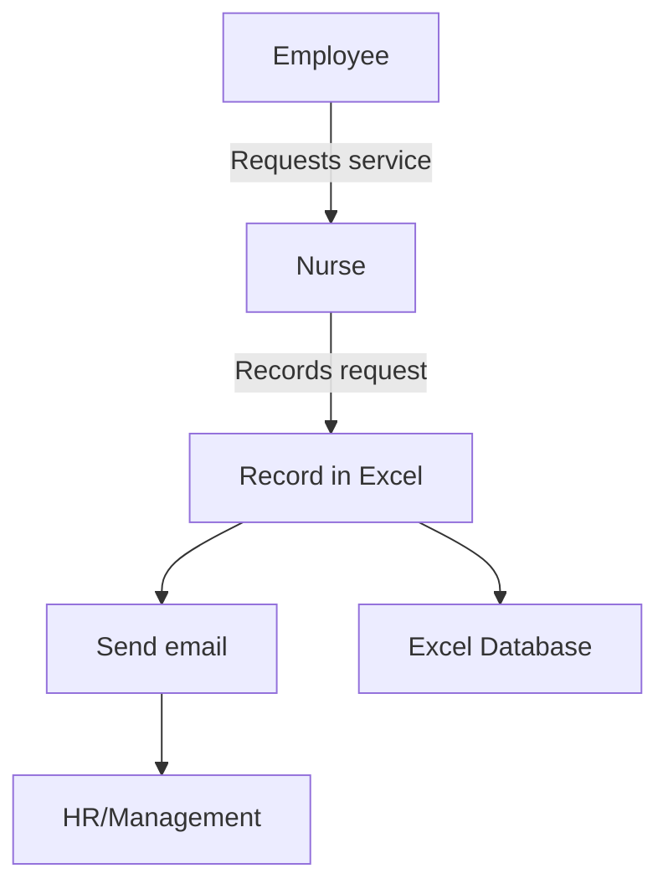

APTIV currently uses a dual-system approach for managing employee data in its healthcare operations. For general management, APTIV employs system XX, while the medical service relies on Excel spreadsheets. This split system was chosen to address different departmental needs, but it has led to some challenges in data integration and overall efficiency.

## Existing Software

### Management System (XX)

APTIV's management employees use system XX for general HR functions. This system handles:

- Employee general information
- Work history
- Leave management
- Shift
### Medical Service System (Excel)

APTIV's medical service uses Excel spreadsheets as their primary tool for managing health-related data. Excel provides a familiar interface for medical staff to input, store, and manipulate employee health data, including:

- Medical records
- Certifications
- Injuries
- Periodic medical visits
- Soin
- Consultation

The medical team utilizes Excel features such as formulas, filters, and sorting to organize and analyze health data.

## Data Flow Diagram (DFD) for the Current System

## Limitations of the Existing System

Despite the attempt to address different needs, APTIV's existing dual-system approach faces several limitations:

1. **Data Integration Issues**: The use of two separate systems leads to difficulties in integrating management and medical data, potentially causing inconsistencies and inefficiencies.

2. **Limited Collaboration**: Collaboration between management and medical teams is hindered due to the use of different systems, leading to potential communication gaps.

3. **Data Security Concerns**: While system XX may have robust security features, Excel files used by the medical service are susceptible to security risks such as unauthorized access and data breaches.

4. **Scalability Problems**: As APTIV grows, managing health information in Excel spreadshe