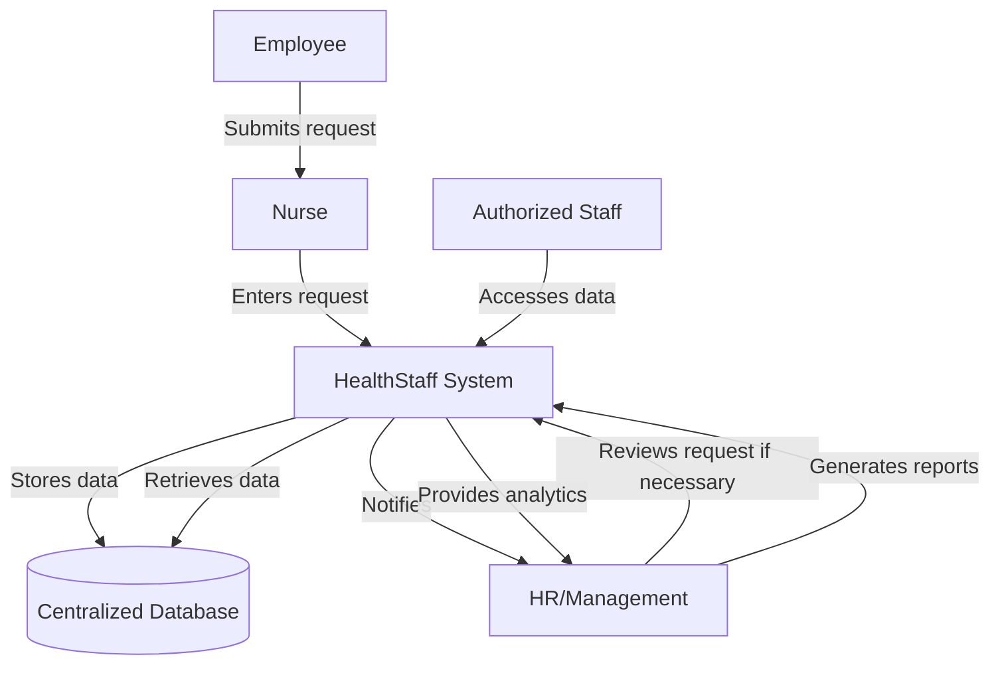

HealthStaff is a comprehensive, web-based solution designed to address the limitations of APTIV's current system and streamline the management of healthcare staff information. This new system aims to integrate all aspects of employee data management, from general HR functions to specific medical service needs.

### Key Features of HealthStaff

1. **Centralized Database**:
- Combines all employee data (general and medical) into a single, secure database.
- Eliminates the need for separate Excel files and email communications.

2. **User-Friendly Interface**:
- Intuitive dashboard for easy navigation and data entry.
- Customizable views for different user roles (HR, nurses, management).

3. **Automated Workflow**:
- Streamlines the process of recording and managing employee requests.
- Automatically notifies relevant parties based on request type and urgency.

4. **Advanced Reporting**:
- Generates comprehensive reports on various aspects of employee health and HR data.
- Provides data visualization tools for better insights and decision-making.

5. **Role-Based Access Control (RBAC)**:
- Ensures data privacy and security by controlling access based on user roles.
- Allows for fine-grained permission settings.

6. **Audit Trail**:
- Maintains a detailed log of all system activities for compliance and tracking purposes.

7. **Scalability**:
- Designed to handle growing data volumes and user base as APTIV expands.

### Proposed Data Flow

This revised diagram correctly shows that the employee submits the request to the nurse, who then enters it into the HealthStaff system. It maintains the key features of centralized data management, automated notifications, and analytical capabilities while accurately representing the workflow starting with the nurse's interaction with the employee.